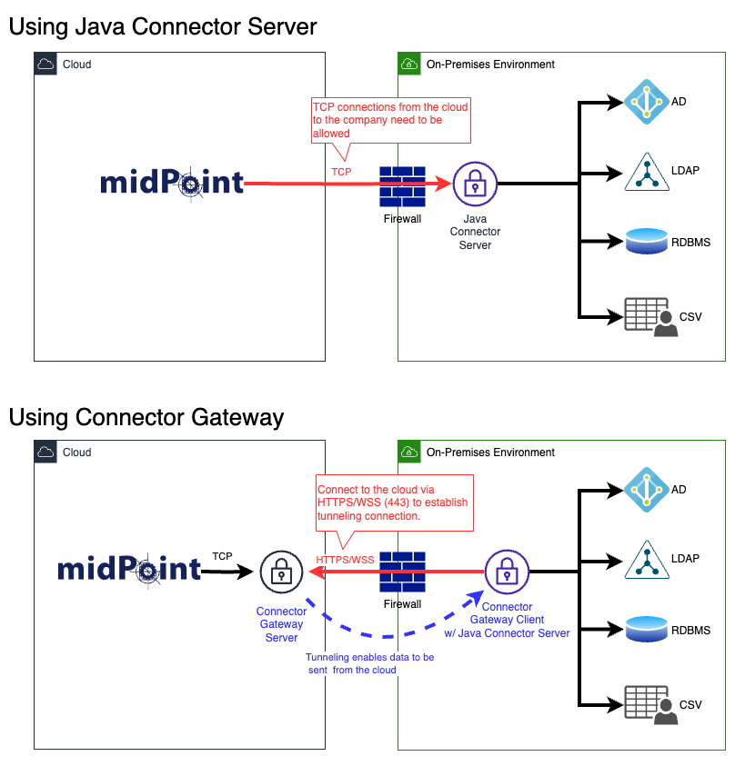

# Connector Gateway

**This repository is heavily under development.**

Connector Gateway is an open-source software that extends the functionality of [Java Connector Server](https://docs.evolveum.com/connectors/connid/1.x/connector-server/java/).
It acts as an intermediary between [midPoint](https://github.com/Evolveum/midpoint) and the resources, serving as a convenient and secure mediator that eliminates the need for a direct access path from midPoint.
It ensures secure communication by utilizing WebSocket for outbound access from the Connector Gateway to midPoint.
As long as there is a route available for WebSocket communication, the Connector Gateway establishes a connection, allowing seamless integration and secure data transfer.

The Connector Gateway consists of two components: the **Connector Gateway Server** and the **Connector Gateway Client**.

The Connector Gateway Server acts as a WebSocket endpoint, accepting connections from the Connector Gateway Client.
It also serves as the TCP connection (port 8759) endpoint for traditional Connector Server communication from midPoint.
Essentially, the Connector Gateway Server acts as an intermediary, receiving communication from midPoint and forwarding it to the Connector Gateway Client, which is connected via WebSocket.
This enables seamless communication between midPoint and the Connector Gateway Client using WebSocket technology.

The Connector Gateway Client contains the complete functionality of the Java Connector Server, offering all its capabilities.
By installing the Connector Gateway Client, there is no need for a separate installation of the Java Connector Server.
It functions as a WebSocket client, establishing a connection to the WebSocket endpoint provided by the Connector Gateway Server.
Its role is to seamlessly relay the communication received from midPoint, which is forwarded by the Connector Gateway Server, and efficiently collaborate with various connectors.

The Connector Gateway offers several advantages over the traditional approach of using the Java Connector Server:

- With the Java Connector Server approach, it is necessary to ensure inbound network routes from midPoint. However, the Connector Gateway operates exclusively through outbound communication.
- This becomes particularly advantageous when midPoint is deployed in cloud environments, and the resources it needs to connect to are located in on-premises environments, which often have restricted network access.



## Features

- Allows access to the resources without requiring a direct access path from midPoint.
- Outbound access from the Connector Gateway Client to midPoint is possible through an HTTPS/WSS route on port 443.
- Supports connections through an HTTP proxy, allowing connectivity in scenarios where an HTTP proxy is required for network communication.
- Automatic reconnection feature ensures continuous connectivity.

## Current Limitations

- High Availability (HA) configuration is not yet supported.
- Authentication for the connection is currently implemented using a simple API key file.
- This software alone does not provide WebSocket Secure (wss) connectivity. In a production environment, it is necessary to deploy a load balancer that supports wss and terminates WebSocket Secure connections in front of the Connector Gateway.

## Usage

Before using the Connector Gateway, ensure that you have OpenJDK 11 or a higher version installed.

### Connector Gateway Server

1. Download the ZIP file and extract it.
2. Execute `./bin/ConnectorGatewayServer.sh` to start the Connector Gateway Server.

Note: To enable authentication, set the environment variable `API_KEY_FILE` to the path of a file containing the API key string. If left unset, the server will start without authentication.

### Connector Gateway Client

1. Download the ZIP file and extract it.
2. Edit the `conf/connectorserver.properties` file to configure the connection settings. While this file is the configuration file for the Java Connector Server, for Connector Gateway Client-specific settings, add the following properties:
    - `connectorgateway.url`: Set the endpoint URL of the Connector Gateway Server to establish the connection.
    - `connectorgateway.apiKey`: If authentication is enabled, specify the API key.
    - `connectorgateway.proxy`: Set the URL if you need to use a proxy server.
3. Similar to the regular Java Connector Server, place the JAR files of the connectors you intend to use in the `bundles` directory.
4. Execute `./bin/ConnectorGatewayClient.sh -run -properties conf/connectorserver.properties` to start the Connector Gateway Client.

### midPoint

Add a connector host by importing the following XML:

```
<connectorHost xmlns="http://midpoint.evolveum.com/xml/ns/public/common/common-3" xmlns:t="http://prism.evolveum.com/xml/ns/public/types-3">
    <name>Connector Gateway Server</name>
    <hostname>your-connector-gateway-server.example.com</hostname>
    <port>8759</port>
    <sharedSecret>
        <t:clearValue>changeit</t:clearValue>
    </sharedSecret>
</connectorHost>
```

Then, execute the discovery process for the registered connector host from the Connector Host list page in midPoint.
If the process completes successfully, the Connector object corresponding to the connector JAR placed in the `bundles` directory of the Connector Gateway Client should be registered.
You can then configure the resource definition to use the registered Connector object.

## License

Licensed under the [Apache License 2.0](LICENSE).
